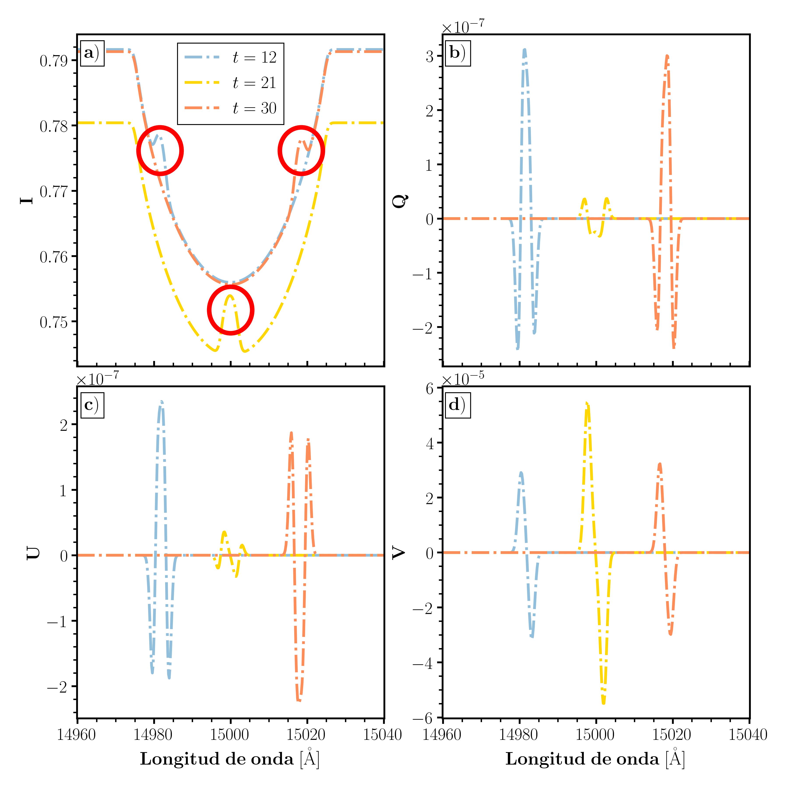

# Práctica 2: “Zeeman Doppler Imaging” de una superficie estelar
    

El código utilizado para este entregable y que genera todas las figuras del mismo puede encontrarse en [`analisis.ipynb`](analisis.ipynb). En [`data`](data) se encuentran los datos de la simulación.

Se utilizan los paquetes externos `numpy`, `matplotlib` y `scipy`.

